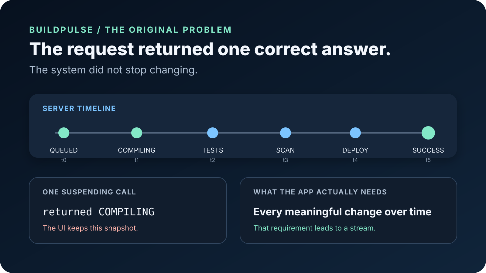
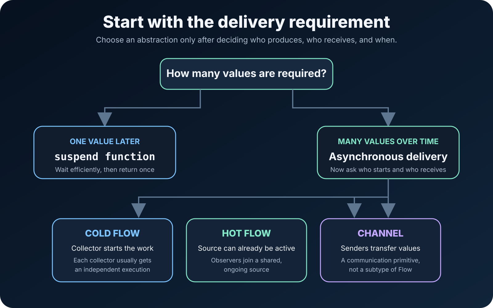
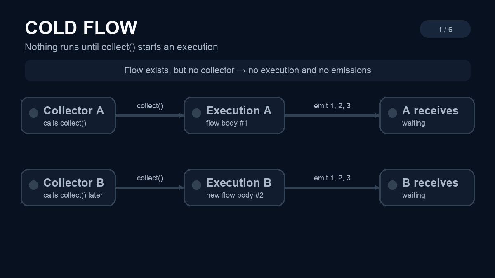
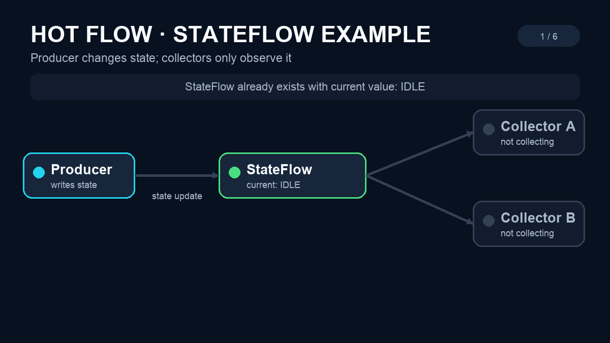
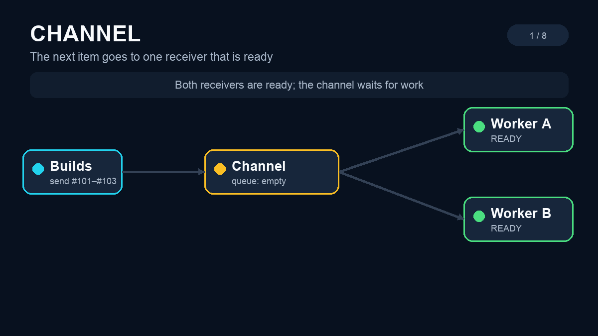

# Building a Live CI/CD Monitor: Why Asynchronous Streams Exist in Kotlin

*One evolving engineering problem to understand Flow, StateFlow, SharedFlow, and Channel—before memorizing any API.*

> **BuildPulse series · Article 1 of 9**
>
> Previous: Start here · **You are here: Asynchronous streams** · [Next: Cold Flow](02-cold-flow.md)

Most explanations of Kotlin Flow begin with `flow {}` and `collect()`.

That teaches syntax before it teaches the problem. You may remember how to write a Flow and still be unsure why it exists.

Let us begin somewhere else: a build that refuses to stand still.

## A successful request can still produce a broken screen

Imagine that we are building **BuildPulse**, an Android dashboard for a CI/CD pipeline.

A build moves through several stages:

```text
QUEUED → COMPILING → RUNNING_TESTS → SECURITY_SCAN → DEPLOYING → SUCCEEDED
```

Our screen calls the build server and receives `COMPILING`. The request succeeds. No exception occurs. The thread is not blocked. The UI correctly displays `COMPILING`.

Five seconds later, the server moves to `RUNNING_TESTS`.

The UI still displays `COMPILING`.

Nothing is technically wrong with the value we received. It was correct when it arrived. The problem is that we treated a **changing fact** as if it were a **permanent answer**.



This distinction is the foundation of the complete series.

## First question: how many answers do we need?

Compare these three shapes:

```kotlin
fun appName(): String

suspend fun fetchBuildStatus(): BuildStatus

fun observeBuildStatus(): Flow<BuildStatus>
```

They answer different questions.

### A regular function: one answer now

`appName()` returns one value immediately.

### A suspending function: one answer later

`fetchBuildStatus()` may pause while waiting for the server. During that pause, the coroutine does not need to block its thread.

But `suspend` does not mean “keep sending results.” It changes **how the function waits**, not **how many values it returns**.

This is the first memory rule:

> **Suspend means one asynchronous result. Stream means multiple results over time.**

### A stream: many answers over time

`observeBuildStatus()` can represent the entire changing sequence:

```text
t0        t1           t2              t3          t4
QUEUED → COMPILING → RUNNING_TESTS → DEPLOYING → SUCCEEDED
```

The receiver does not repeatedly ask, “What is the answer now?” The producer emits new values as the answer changes.

## Why not call the suspending function repeatedly?

We could poll:

```kotlin
while (screenIsVisible) {
    render(fetchBuildStatus())
    delay(2_000)
}
```

Polling is sometimes valid. It is not the same as observing a stream.

It immediately creates new questions:

- What if the status changes twice during the two-second delay?
- What if thousands of clients poll the server together?
- Who stops the loop when the screen disappears?
- How are errors retried?
- What if a new request starts before the previous request finishes?
- What if two screens need the same build updates?

Repeatedly requesting snapshots does not automatically create a well-defined stream. We still need rules for production, cancellation, sharing, delivery, and speed differences.

## What exactly is an asynchronous stream?

An asynchronous stream is a sequence whose values can become available at different moments.

Break the name into parts:

- **Asynchronous:** the consumer does not expect every value to be available immediately.
- **Stream:** values pass through over time rather than appearing as one permanent result.

A stream is not necessarily fast. It is not necessarily infinite. It does not necessarily use a network. A database query, sensor, timer, callback, WebSocket, and simulated build can all become stream producers.

In Kotlin coroutines, `Flow<T>` is the primary abstraction for representing such values declaratively.

But saying “use Flow” is still incomplete. We need to understand how the producer and consumers relate.

## The four questions behind every stream choice

Before choosing `Flow`, `StateFlow`, `SharedFlow`, or `Channel`, ask:

1. **Who starts the producer?**
2. **Does the producer continue without observers?**
3. **Should every observer receive the value, or only one receiver?**
4. **Should a late observer receive an old or current value?**

Cold streams, hot streams, and channels are different answers to these questions.



## Cold stream: work that waits for a collector

Why the name **cold**?

Think about an engine that has not been started. The machine exists, but no work happens until someone turns it on.

A cold stream behaves similarly:

- Creating it normally does not start the producer.
- Collection starts the work.
- A second collector usually starts another independent execution.
- When nobody collects, that execution is not running.



*The first `collect()` starts Execution A and its emissions. A later `collect()` starts a separate Execution B and restarts the values for that collector.*

Inside BuildPulse, “generate a build-history report for this screen” could be cold. Each collector asks for its own execution when needed.

Later articles will separate three cold-flow tools:

- `flow {}` for sequential suspending production.
- `callbackFlow` for adapting callback APIs.
- `channelFlow` for concurrent producers inside one cold Flow.

Important: `callbackFlow` and `channelFlow` contain the word “channel,” but the objects they return are still cold `Flow`s. Their names describe how values enter the builder, not a change from cold to hot.

## Hot stream: an active source that observers can join

Why the name **hot**?

A running build is already producing activity. Opening or closing the dashboard does not start or stop the compiler on the CI server.

That source is active independently of one particular observer.

A hot stream commonly behaves like this:

- The source can exist without a collector.
- Multiple collectors can observe the same ongoing source.
- A late collector may miss earlier values unless replay or current-state behavior is configured.
- Removing one collector does not necessarily stop the source.



*This `StateFlow` example separates subscription from state changes: only the producer updates `IDLE → COMPILING → RUNNING_TESTS`; collectors observe the current and future states.*

BuildPulse has two distinct hot-stream needs:

- **Current build state:** “What stage is the build in now?” This points toward `StateFlow`.
- **Broadcast activity:** “Test 47 failed” or “Deployment started.” This may point toward `SharedFlow`.

The words *state* and *shared* are clues. `StateFlow` represents a current state. `SharedFlow` shares emitted values among subscribers with configurable replay and buffering.

We will examine their exact rules later. For now, remember that “hot” describes the producer’s relationship with observers—not temperature, speed, or importance.

## Channel: transfer, not shared observation

A `Channel` belongs on the same learning map, but it is not a subtype of `Flow`.

Why the name **channel**?

A physical channel connects two sides and gives something a route through which to travel. A coroutine Channel similarly connects senders and receivers.

In BuildPulse, imagine a queue of build jobs:



*Worker selection is not guaranteed round-robin. The next item goes to one receiver that is ready; timing and scheduling can change which worker receives it.*

The goal is usually work transfer. One worker receives a job and processes it. We do not normally want every worker to execute the same build.

That differs from a hot broadcast stream, where multiple observers may need the same update.

Memory rule:

> **Flow describes values to observe. Channel transfers values between coroutines.**

This is a useful default, not a law for every advanced design. Kotlin provides bridges between the two abstractions, which we will cover only after their individual semantics are clear.

## The complete BuildPulse map

| BuildPulse requirement | Concept it will teach | Why |
|---|---|---|
| Fetch build status once | `suspend` function | One result is required later |
| Request an independent history report | Cold `Flow` | Work begins for each collector |
| Adapt CI SDK listeners | `callbackFlow` | Callbacks need structured cancellation and cleanup |
| Merge compiler, test, and scanner producers | `channelFlow` | Several coroutines produce concurrently |
| Hold the current pipeline snapshot | `StateFlow` | New observers need the latest state |
| Broadcast logs and transient activity | `SharedFlow` | Several observers may receive the same emission |
| Share one expensive upstream connection | `stateIn` / `shareIn` | Cold work becomes shared hot observation |
| Distribute build jobs to workers | `Channel` | Each job should be transferred to a receiver |

This table is our series contract. We will not swap analogies in every article. We will keep solving this one system, one limitation at a time.

## Try the Phase 1 experiment

The companion Android project intentionally contains no production Flow implementation yet.

It presents two values:

- **Server now:** the simulator’s current build stage.
- **UI snapshot:** the last value returned by the suspending read.

Try this sequence:

1. Select **Fetch snapshot**. Both values show `QUEUED`.
2. Select **Advance server**. The server changes to `COMPILING`.
3. Notice that the UI snapshot remains `QUEUED`.
4. Fetch again. Both values match.
5. Advance twice without fetching. The gap becomes obvious again.

The repository is an optional lab, not a prerequisite for understanding this article:

- [Run BuildPulse](../README.md)
- [Read the one-shot contract](../app/src/main/java/io/github/buildpulse/simulation/BuildContracts.kt)
- [See the stale-snapshot test](../app/src/test/java/io/github/buildpulse/simulation/InMemoryBuildSimulatorTest.kt)
- Milestone: `article-01-introduction`

## Common misconceptions

### “If a function is suspend, it keeps observing changes.”

No. A suspending function can pause and later return one result. Observation requires another contract.

### “Flow means background thread.”

No. Flow describes asynchronous value delivery. Execution context is a separate concern.

### “All Flow objects are cold.”

No. Many standard Flow builders are cold, while `StateFlow` and `SharedFlow` are hot. The `Flow` interface itself does not encode coldness in its type.

### “Channel is just another Flow.”

No. They have different primary semantics. Flow focuses on observation; Channel focuses on communication and transfer.

### “Hot is better because it is already running.”

No. Hot and cold are behavior choices. Starting unnecessary work early can waste resources; repeating expensive cold work for many collectors can also waste resources.

## Check your mental model

Before continuing, answer these without looking back:

1. Does `suspend` mean one value or many values?
2. Who normally starts a cold stream?
3. Can a hot source exist without your screen?
4. If one job should go to one worker, would you first investigate broadcast Flow or Channel semantics?
5. Which question matters more: “Is Flow modern?” or “What delivery behavior does this problem require?”

If the reasoning feels clear, the later APIs become names for behaviors you already understand.

## Where the analogy stops

BuildPulse is a learning system, not a complete definition of coroutines.

Real stream behavior depends on the builder and operators used. Buffering, cancellation, exception transparency, context preservation, replay, lifecycle, and backpressure require exact API rules. We will introduce each rule when the project first needs it rather than pretending one diagram explains everything.

## Learning roadmap

```text
[01] Why asynchronous streams exist          ← You are here
  ↓
[02] Cold Flow and collection
  ↓
[03] callbackFlow and listener cleanup
  ↓
[04] channelFlow and concurrent producers
  ↓
[05] Hot streams and shared producers
  ↓
[06] StateFlow vs SharedFlow
  ↓
[07] stateIn vs shareIn
  ↓
[08] Channel and worker communication
  ↓
[09] Final decision guide and complete BuildPulse
```

Next, we will replace repeated BuildPulse snapshots with a cold Flow and answer two questions precisely:

> When does a Flow actually start, and what happens when two collectors observe it?

## Official references

- [Kotlin coroutines overview](https://kotlinlang.org/docs/coroutines-overview.html)
- [Kotlin Flow guide](https://kotlinlang.org/docs/flow.html)
- [kotlinx.coroutines API](https://kotlinlang.org/api/kotlinx.coroutines/)
- [Android guidance for StateFlow and SharedFlow](https://developer.android.com/kotlin/flow/stateflow-and-sharedflow)

---

**Series navigation**

Previous: Start here · [Series repository](../README.md) · [Next: Cold Flow](02-cold-flow.md)
