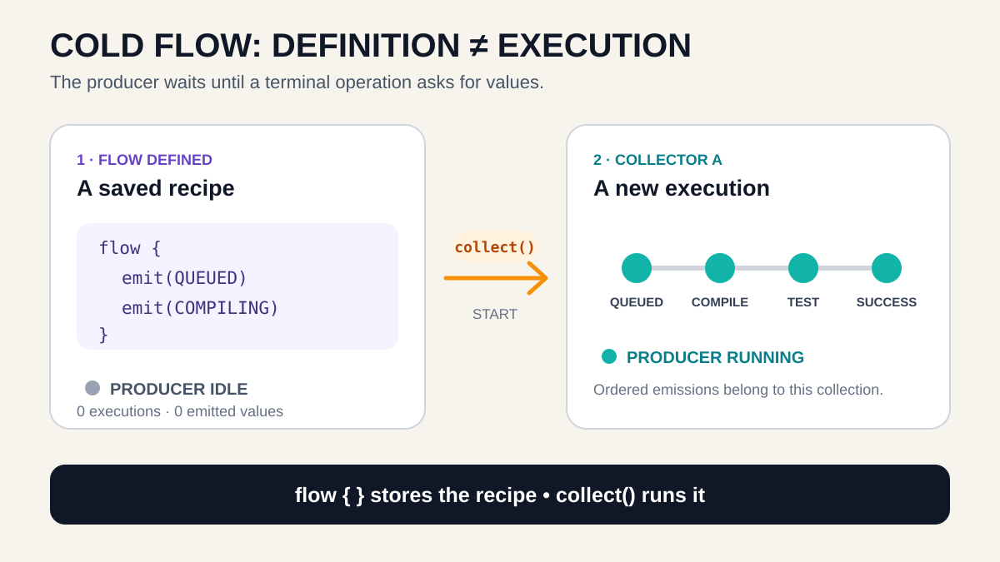
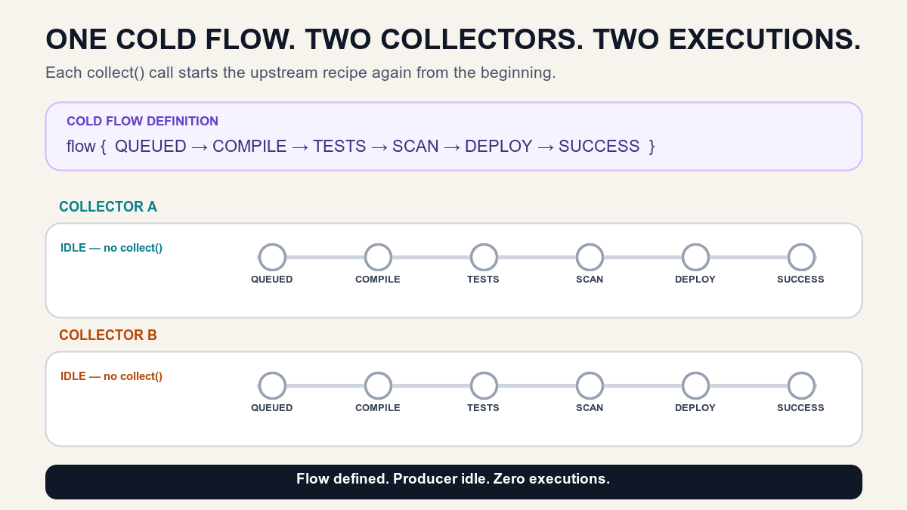

# Cold Flow — Why Nothing Happens Until `collect()`

*A cold Flow is not a running pipeline. It is a reusable description of work—and every collector starts a new execution.*

> **BuildPulse series · Article 2 of 9**
>
> [Previous: Why asynchronous streams exist](https://medium.com/@sandeep84397/building-a-live-ci-cd-monitor-why-asynchronous-streams-exist-in-kotlin-264571c42b62) · **You are here: Cold Flow** · Next: `callbackFlow` *(unpublished)*

In the first article, BuildPulse fetched one CI/CD status:

```text
COMPILING
```

The request was asynchronous and the result was correct. But the build kept moving:

```text
QUEUED → COMPILING → RUNNING_TESTS → SECURITY_SCAN → DEPLOYING → SUCCEEDED
```

Our UI did not.

We proved the original problem: a suspending function can wait efficiently, but it still returns only one value.

Now we need multiple values. But that requirement immediately creates a second problem.

## The engineering problem: who owns the repeated work?

We could repeatedly fetch snapshots:

```kotlin
while (screenIsVisible) {
    val snapshot = fetchBuildStatus()
    render(snapshot)
    delay(1_000)
}
```

The code looks small, but the screen now owns several rules:

- when the work starts;
- how values stay ordered;
- when the loop stops;
- what happens when another screen requests the same history;
- how exceptions and cancellation end the operation.

The real problem is not “how do I write a loop?”

The problem is:

> How do we describe a sequence once, then run that sequence safely whenever a consumer asks for it?

This is where a cold Flow helps.

## Why is it called **cold**?

The name is a behavior hint.

Think of a saved CI replay script.

The script contains every instruction required to replay a build:

```text
load build → read QUEUED → read COMPILING → read tests → read deployment
```

Saving that script does not execute a build replay. It only stores the recipe.

When Developer A presses **Run**, one replay starts.

When Developer B presses **Run**, another replay starts from the beginning.

If nobody presses Run, nothing executes.

That is the reason for the word **cold**: the producer is inactive until a collector starts it.



Map the analogy directly:

| BuildPulse replay | Cold Flow |
|---|---|
| Saved replay script | `flow { ... }` definition |
| Press **Run** | Call `collect()` |
| One replay | One Flow execution |
| Replay checkpoints | Emitted values |
| Stop the replay | Cancel the collecting coroutine |

Memory rule:

> **`flow {}` defines the recipe. `collect()` runs the recipe.**

## Creating a Flow does not start its producer

Consider this small example:

```kotlin
val buildHistory = flow {
    println("Producer started")
    emit("QUEUED")
    emit("COMPILING")
    emit("SUCCEEDED")
}

println("Flow created")
```

Output:

```text
Flow created
```

`Producer started` is absent.

Why? The lambda passed to `flow {}` describes what should happen during collection. Creating `buildHistory` does not yet invoke that producer block.

Now collect it:

```kotlin
buildHistory.collect { stage ->
    println("UI received $stage")
}
```

Output:

```text
Producer started
UI received QUEUED
UI received COMPILING
UI received SUCCEEDED
```

The first terminal operation—`collect()` here—starts the execution.

This is called **lazy execution**. “Lazy” does not mean slow. It means the work waits until its result is requested.

## What happens when two collectors collect the same Flow?

This is the part many developers remember incorrectly.

Run the same object twice:

```kotlin
val buildHistory = flow {
    println("New execution")
    emit("QUEUED")
    emit("COMPILING")
}

buildHistory.collect { println("A: $it") }
buildHistory.collect { println("B: $it") }
```

Output:

```text
New execution
A: QUEUED
A: COMPILING
New execution
B: QUEUED
B: COMPILING
```

Notice `New execution` appears twice.

Collector B does not automatically join Collector A’s earlier execution. The upstream `flow {}` block runs again for B.



This gives us the second memory rule:

> **One cold Flow definition can create many executions—normally one per collector.**

This behavior is useful when every consumer needs fresh or independent work. It can be wasteful when the upstream operation is expensive and should be shared. We will solve that later with hot sharing; we should not introduce that machinery before we understand the work being shared.

## Emission and collection are sequential by default

Inside a basic `flow {}` builder, the producer emits one value at a time:

```kotlin
val buildHistory = flow {
    emit(BuildStage.QUEUED)
    emit(BuildStage.COMPILING)
    emit(BuildStage.RUNNING_TESTS)
}
```

The collector handles those values in the same order:

```text
QUEUED → COMPILING → RUNNING_TESTS
```

The next line in the producer does not leap ahead into a separate concurrent producer merely because Flow is asynchronous. A basic Flow is sequential unless we deliberately introduce operators or builders with different concurrency behavior.

That gives BuildPulse a clear default:

- one producer execution;
- one ordered sequence;
- one collecting coroutine that owns that execution.

We are intentionally not adding buffering or concurrency in this article. Those tools solve different problems and change how producer and consumer speed interact.

## Cancellation: stop the collector, stop that execution

Suppose Collector A is replaying a build:

```text
QUEUED → COMPILING → RUNNING_TESTS → ...
```

The user leaves the screen after `COMPILING`.

If the coroutine running `collect()` is cancelled, the cold Flow execution is cancelled too. Later values do not keep arriving in that collector.

```kotlin
val collectionJob = scope.launch {
    buildHistory.collect { stage ->
        render(stage)
    }
}

collectionJob.cancel()
```

This ownership is important. The collection is not a detached loop hidden somewhere else. Its lifetime follows the coroutine that collects it.

On Android, the UI should normally collect through lifecycle-aware APIs so collection starts and stops with the relevant lifecycle. We are postponing the exact `StateFlow` and Compose collection APIs until their own articles; the rule to remember now is simpler:

> **The collecting coroutine owns the cold execution.**

## The BuildPulse implementation

The repository contract says that BuildPulse can observe a history:

```kotlin
fun interface BuildHistoryReader {
    fun observeHistory(buildId: BuildId): Flow<BuildSnapshot>
}
```

Its implementation defines a cold recipe:

```kotlin
class ColdBuildHistoryRepository : BuildHistoryReader {
    override fun observeHistory(buildId: BuildId): Flow<BuildSnapshot> = flow {
        BuildStage.entries.forEachIndexed { index, stage ->
            emit(
                BuildSnapshot(
                    buildId = buildId,
                    stage = stage,
                    sequence = index,
                ),
            )
            if (stage != BuildStage.SUCCEEDED) {
                delay(700)
            }
        }
    }
}
```

Calling `observeHistory()` creates the Flow. It does not run the loop.

Collector A starts the loop once. Collector B starts it again. Each receives its own sequence from `QUEUED`.

The Android lab keeps both timelines visible so the behavior is harder to forget:

```text
Flow defined

Collector A:  QUEUED → COMPILING → RUNNING_TESTS → ...
Collector B:  QUEUED → COMPILING → RUNNING_TESTS → ...
              ↑ separate execution, not a shared continuation
```

The project is supporting evidence, not required reading:

- [Run the Article 02 checkpoint](https://github.com/sandeep84397/buildpulse-kotlin-flows/tree/article-02-cold-flow)
- [Read the cold repository](../app/src/main/java/io/github/buildpulse/simulation/ColdBuildHistoryRepository.kt)
- [Read the behavior tests](../app/src/test/java/io/github/buildpulse/simulation/ColdBuildHistoryRepositoryTest.kt)
- [Compare Article 01 with Article 02](https://github.com/sandeep84397/buildpulse-kotlin-flows/compare/article-01-introduction...article-02-cold-flow)
- [Open the Article 02 GitHub release](https://github.com/sandeep84397/buildpulse-kotlin-flows/releases/tag/article-02-cold-flow)

## When should you use a cold Flow?

Start by considering a cold Flow when:

- work should begin only when requested;
- each collector should receive a fresh execution;
- the operation naturally produces several ordered values;
- cancellation should follow the collecting coroutine;
- keeping the producer active with zero collectors would waste work.

Common examples include:

- reading rows from a database query for each request;
- generating a report on demand;
- observing a finite sequence of progress updates for one operation;
- transforming another cold data source;
- replaying BuildPulse history independently for two tools.

Do not choose it automatically when:

- several screens must observe one already-running source;
- new collectors need the current shared state immediately;
- one expensive upstream connection must be shared;
- each item should be transferred to only one worker.

Those requirements point toward later parts of our map: hot streams, `StateFlow`, `SharedFlow`, sharing operators, or `Channel`.

## Common misconceptions

### “I assigned the Flow to a variable, so it is running.”

No. A cold Flow definition is a recipe. A terminal operation starts it.

### “Two collectors share the same execution because they use the same Flow object.”

Normally no. Each collection invokes the cold producer again.

### “Cold means slow.”

No. Cold describes the producer’s relationship with collectors, not speed.

### “Flow automatically runs on a background thread.”

No. Flow does not imply a particular thread. Coroutine context is a separate rule.

### “Asynchronous means concurrent.”

No. A basic Flow can suspend without blocking while still emitting and collecting sequentially.

### “Cancelling one collector cancels every collector.”

No. Independent cold executions have independent collecting jobs. Cancelling A does not automatically cancel B.

## The complete mental model

When you see a cold Flow, ask four questions:

1. **Definition:** What recipe is stored inside `flow {}`?
2. **Start:** Which terminal operation begins it?
3. **Execution count:** How many collectors will run the upstream work?
4. **Lifetime:** Which collecting coroutine cancels each execution?

For our current BuildPulse history:

```text
No collect()          → no replay
Collector A starts   → Execution A begins at QUEUED
Collector B starts   → Execution B begins at QUEUED
Collector A stops    → Execution A stops; B continues
```

If that sequence is clear, you understand the foundation of cold Flow.

## Where we go next

Our current producer is easy because it already uses suspending Kotlin code inside `flow {}`.

Real CI SDKs often expose callbacks instead:

```kotlin
listener.onBuildChanged { status -> ... }
```

The next limitation is therefore different:

> How do we convert a callback that can fire many times into a cold Flow—and guarantee that the listener is removed when collection stops?

That is the job of `callbackFlow`.

## Official references

- [Kotlin `flow` builder API](https://kotlinlang.org/api/kotlinx.coroutines/kotlinx-coroutines-core/kotlinx.coroutines.flow/flow.html)
- [Kotlin `Flow` API](https://kotlinlang.org/api/kotlinx.coroutines/kotlinx-coroutines-core/kotlinx.coroutines.flow/-flow/)
- [Kotlin Flow guide](https://kotlinlang.org/docs/coroutines-flow.html)

---

*BuildPulse is one evolving Android/Compose system. Each article introduces only the next concept required by the engineering problem, and each GitHub milestone remains runnable.*
