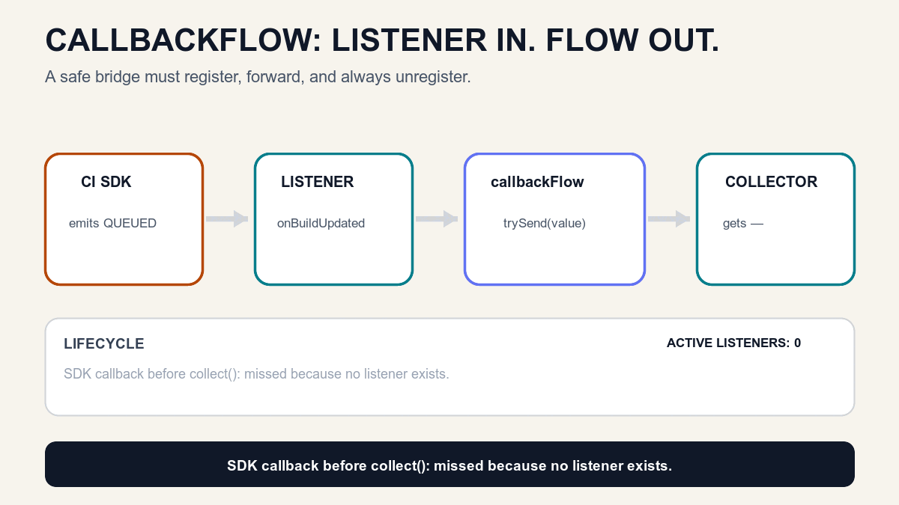

# `callbackFlow` — How a Listener Becomes a Flow Without Leaking

*`callbackFlow` adapts a callback API into a cold Flow: collection registers a listener, callbacks become values, and cancellation unregisters the listener.*

> **BuildPulse series · Article 3 of 9**
>
> [Previous on Medium: Cold Flow — Why Nothing Happens Until `collect()`](https://medium.com/@sandeep84397/cold-flow-why-nothing-happens-until-collect-927b9b10823d) · [Repository article](02-cold-flow.md) · **You are here: `callbackFlow`** · [Next: `channelFlow`](04-channel-flow.md)

In Article 2, our producer already spoke Kotlin's language:

```kotlin
flow {
    emit(BuildStage.QUEUED)
    emit(BuildStage.COMPILING)
}
```

That works when we own the suspending code that produces the values.

Real Android and backend integrations often do not look like that. A CI SDK, Bluetooth scanner, location client, WebSocket library, or legacy Java API may own the producer and call us through a listener:

```kotlin
ciSdk.addListener { update ->
    // The SDK decides when this runs.
}
```

Our UI wants a `Flow<BuildSnapshot>`, but the SDK gives us `addListener()` and `removeListener()`.

That mismatch is the Article 3 problem.

## The engineering problem: who owns the listener?

Registering a listener is easy. Owning its complete lifetime is harder.

```kotlin
ciSdk.addListener(listener)
```

Now ask:

- When should registration happen?
- How does a callback become a Flow value?
- What happens if the user leaves the screen?
- Who calls `removeListener()`?
- What if two collectors observe the same Flow?

If cleanup is forgotten, the SDK can keep a dead screen or repository alive. It may continue doing work, deliver duplicate updates after a new listener is added, or leak memory.

So the real problem is not “how do I call `addListener()`?”

It is:

> How do we make listener registration, value delivery, and cleanup follow the lifetime of Flow collection?

## Why is it named `callbackFlow`?

The name describes the bridge.

- **Callback:** another component owns the timing and calls our listener when something happens.
- **Flow:** our application receives those callback invocations as a collectable stream of values.

```text
Callback API  →  callbackFlow bridge  →  Flow collector
```

It does not mean “a special hot Flow.” The resulting Flow is cold. Its block runs for every collection.

Memory rule:

> **A callback calls us. `callbackFlow` carries that call into Flow.**

## The cornerstone analogy: a CI control-room phone

Imagine that BuildPulse has a control room. It announces build changes, but only to registered phone operators.

- CI control room = callback-based SDK
- Register a phone operator = `addListener()`
- Incoming build alert = callback invocation
- Operator passes the note onward = `trySend(update)`
- BuildPulse desk reads the note = Flow collector
- Desk closes = collection is cancelled
- Operator returns the phone = `awaitClose { removeListener() }`

Before a collector arrives, no operator is registered. An alert sent at that time is missed.

When Collector A starts, one operator registers. Future alerts reach A.

When Collector B starts, a second operator registers. The SDK calls both listeners, so both collectors receive future updates.

When A stops, A's operator unregisters. B remains registered and continues receiving alerts.

This is the complete lifecycle:

```text
No collector
    ↓
No listener
    ↓ collect()
addListener(listener)
    ↓ SDK invokes callback
trySend(update)
    ↓
Collector receives update
    ↓ collection cancelled
awaitClose { removeListener(listener) }
    ↓
No listener, no more delivery
```



Memory rule:

> **Register → Forward → Unregister.**

## The smallest useful example

Assume a callback API with an explicit registration contract:

```kotlin
interface BuildCallbackSource {
    fun addListener(listener: BuildUpdateListener)
    fun removeListener(listener: BuildUpdateListener)
}

fun interface BuildUpdateListener {
    fun onBuildUpdated(snapshot: BuildSnapshot)
}
```

We can adapt it once:

```kotlin
fun observeBuild(
    source: BuildCallbackSource,
): Flow<BuildSnapshot> = callbackFlow {
    val listener = BuildUpdateListener { snapshot ->
        trySend(snapshot)
    }

    source.addListener(listener)

    awaitClose {
        source.removeListener(listener)
    }
}
```

Now follow one collection:

```text
1. observeBuild(source) created        → listener count = 0
2. collect() starts                    → listener count = 1
3. SDK callback: COMPILING             → trySend(COMPILING)
4. collector receives COMPILING
5. collecting coroutine is cancelled   → awaitClose cleanup runs
6. removeListener(listener)             → listener count = 0
7. SDK callback: RUNNING_TESTS          → collector receives nothing
```

Creating the Flow does not register anything. `collect()` does.

That is why `callbackFlow` is still cold.

## What exactly do `trySend()` and `awaitClose()` do?

### `trySend()` forwards a callback without suspending it

A normal callback function is usually not a suspending function. It cannot safely call the suspending `send()` operation directly.

`trySend(value)` attempts to place the value into `callbackFlow`'s channel immediately and returns a result describing success or failure.

```kotlin
val result = trySend(snapshot)

if (result.isFailure) {
    // The collector may already be gone, or capacity may be unavailable.
}
```

BuildPulse intentionally keeps the first example small and uses the default capacity. Buffer size, overflow policy, and backpressure deserve a separate discussion because they change delivery guarantees.

### `awaitClose()` keeps the bridge alive and owns cleanup

Without `awaitClose`, the builder block reaches its end immediately after registration. If the callback channel is still open, `callbackFlow` fails fast with `IllegalStateException` instead of allowing the listener to leak silently.

```kotlin
source.addListener(listener)

awaitClose {
    source.removeListener(listener)
}
```

`awaitClose` suspends while the bridge is active. When collection is cancelled or the channel closes, its cleanup block runs.

This gives one place responsibility for both sides of the lifetime:

```text
collect starts  → register resource
collect stops   → unregister resource
```

The callback API's register and unregister methods must be safe when cancellation races with a callback or registration. That requirement belongs to the callback API contract, not only to Flow.

## Two collectors mean two listener registrations

The same cold behavior from Article 2 still applies:

```kotlin
val updates = repository.observeHistory(buildId)

scope.launch { updates.collect { println("A: ${it.stage}") } }
scope.launch { updates.collect { println("B: ${it.stage}") } }
```

Expected lifecycle:

```text
Collector A starts  → addListener(A) → listener count = 1
Collector B starts  → addListener(B) → listener count = 2

SDK: COMPILING      → A receives COMPILING
                    → B receives COMPILING

Collector A stops   → removeListener(A) → listener count = 1
SDK: RUNNING_TESTS  → B receives RUNNING_TESTS
```

The collectors receive the same future SDK event because the SDK calls every registered listener. They are not sharing one `callbackFlow` execution; each collection has its own execution and listener.

If one upstream registration must be shared by many screens, we will need a sharing operator or hot stream later in the series.

## What happens to callbacks sent before collection?

They are missed.

```text
SDK: QUEUED         → zero listeners → missed
Collector starts    → listener registered
SDK: COMPILING      → delivered
```

`callbackFlow` adapts future callback invocations. It does not automatically remember the last state or replay old events.

If a new collector must immediately receive the current build state, the design needs an initial query, replay, or state holder. That is a different requirement; we will address state with `StateFlow` later.

## The BuildPulse implementation

The repository now depends on a small callback abstraction instead of a concrete SDK:

```kotlin
class CallbackFlowBuildHistoryRepository(
    private val callbackSource: BuildCallbackSource,
) : BuildHistoryReader {

    override fun observeHistory(buildId: BuildId): Flow<BuildSnapshot> = callbackFlow {
        val listener = BuildUpdateListener { snapshot ->
            if (snapshot.buildId == buildId) {
                trySend(snapshot).onFailure {
                    // This low-rate lab deliberately drops an update that cannot be accepted.
                }
            }
        }

        callbackSource.addListener(listener)
        awaitClose {
            callbackSource.removeListener(listener)
        }
    }
}
```

The Android/Compose lab makes the invisible lifetime visible:

1. Advance the simulated server before listening. The update is missed.
2. Start Collector A. The listener count becomes one.
3. Advance the server. A receives the callback value.
4. Start Collector B. The listener count becomes two.
5. Advance again. Both collectors receive the new value.
6. Stop A. The listener count returns to one.
7. Advance again. Only B receives the value.

The UI is not the proof of correctness; deterministic tests are.

## Tests that protect the behavior

The milestone verifies five rules:

```text
Flow created, not collected  → zero listeners
Collection starts            → listener registered; matching events stay ordered
Different build event        → ignored
Collection cancelled         → listener removed; later callbacks not delivered
Two collectors stop in turn  → listener count follows 0 → 1 → 2 → 1 → 0
```

The cancellation test is the most important one:

```kotlin
val collection = launch {
    repository.observeHistory(buildId).collect(received::add)
}

runCurrent()
assertEquals(1, sdk.listenerCount)

collection.cancelAndJoin()
assertEquals(0, sdk.listenerCount)

sdk.publish(runningTests)
assertEquals(listOf(compiling), received)
```

This test checks observable ownership, not an implementation detail.

Supporting project:

- [Run the Article 03 checkpoint](https://github.com/sandeep84397/buildpulse-kotlin-flows/tree/article-03-callback-flow)
- [Read the `callbackFlow` repository](../app/src/main/java/io/github/buildpulse/simulation/CallbackFlowBuildHistoryRepository.kt)
- [Read the behavior tests](../app/src/test/java/io/github/buildpulse/simulation/CallbackFlowBuildHistoryRepositoryTest.kt)
- [Compare Article 02 with Article 03](https://github.com/sandeep84397/buildpulse-kotlin-flows/compare/article-02-cold-flow...article-03-callback-flow)
- [Open the Article 03 GitHub release](https://github.com/sandeep84397/buildpulse-kotlin-flows/releases/tag/article-03-callback-flow)

## When should you use `callbackFlow`?

Use it when all of these are true:

- an existing API pushes zero or many values through callbacks or listeners;
- you want to expose those values as a cold Flow;
- registration should begin with collection;
- cancellation must release the callback resource;
- callback invocations may arrive outside the collecting coroutine's context.

Common Android examples:

- location updates;
- Bluetooth scan results;
- Firebase-style listeners;
- connectivity callbacks;
- sensor or camera events;
- a Java SDK that exposes `registerListener()`.

Do not use it automatically when:

- the API returns exactly one result — a cancellable suspending adapter may fit better;
- you already have a Flow — use Flow operators rather than converting it back to callbacks;
- many screens must share one registration — sharing is a separate decision;
- several child coroutines must concurrently send values — that points toward `channelFlow`.

## Common mistakes

### “`callbackFlow` is hot because the SDK is already running.”

No. The returned Flow is cold. Every collector runs the builder block and normally registers its own listener.

### “`trySend()` guarantees that every callback was delivered.”

No. It returns a `ChannelResult`. Delivery can fail when the channel is closed or capacity is unavailable. Decide deliberately whether to ignore, log, retry, or fail.

### “The listener disappears automatically when the screen closes.”

Only if collection is cancelled and the bridge unregisters it in cleanup. The lifetime must be encoded.

### “`awaitClose` is just an infinite delay.”

No. It waits for channel closure or cancellation and executes the cleanup block before returning.

### “A new collector receives the latest callback value.”

Not automatically. An event emitted before registration is not replayed by `callbackFlow`.

### “Two collectors share one listener.”

Not by default. Two collections run two cold builder executions and register two listeners.

## The complete mental model

When adapting a callback, ask five questions:

1. **Register:** Which collection starts the listener?
2. **Forward:** How does each callback enter the Flow?
3. **Failure:** What should happen if `trySend()` fails?
4. **Cleanup:** Which cancellation path unregisters the listener?
5. **Multiplicity:** How many collectors—and therefore registrations—will exist?

For BuildPulse:

```text
Flow created          → 0 listeners
Collector A starts    → 1 listener
Collector B starts    → 2 listeners
SDK emits             → A and B receive the future update
Collector A stops     → 1 listener
Collector B stops     → 0 listeners
```

If you can predict that count and delivery path, you understand `callbackFlow`.

## Where we go next

BuildPulse can now adapt one CI SDK listener into a safe Flow.

The next version has three producers:

```text
Compiler callback ─┐
Test runner callback ├─→ one build timeline
Security scanner ──┘
```

Those sources can report concurrently. A basic single callback adapter is no longer the whole problem.

Next question:

> How can several concurrent producers safely send into one Flow?

That is the job of `channelFlow`.

## Official references

- [Kotlin `callbackFlow` API](https://kotlinlang.org/api/kotlinx.coroutines/kotlinx-coroutines-core/kotlinx.coroutines.flow/callback-flow.html)
- [Kotlin `awaitClose` API](https://kotlinlang.org/api/kotlinx.coroutines/kotlinx-coroutines-core/kotlinx.coroutines.channels/await-close.html)
- [Kotlin `trySend` API](https://kotlinlang.org/api/kotlinx.coroutines/kotlinx-coroutines-core/kotlinx.coroutines.channels/-send-channel/try-send.html)
- [Kotlin Flow guide](https://kotlinlang.org/docs/coroutines-flow.html)

---

*BuildPulse is one evolving Android/Compose system. Each article introduces only the next concept required by the engineering problem, and each GitHub milestone remains runnable.*
