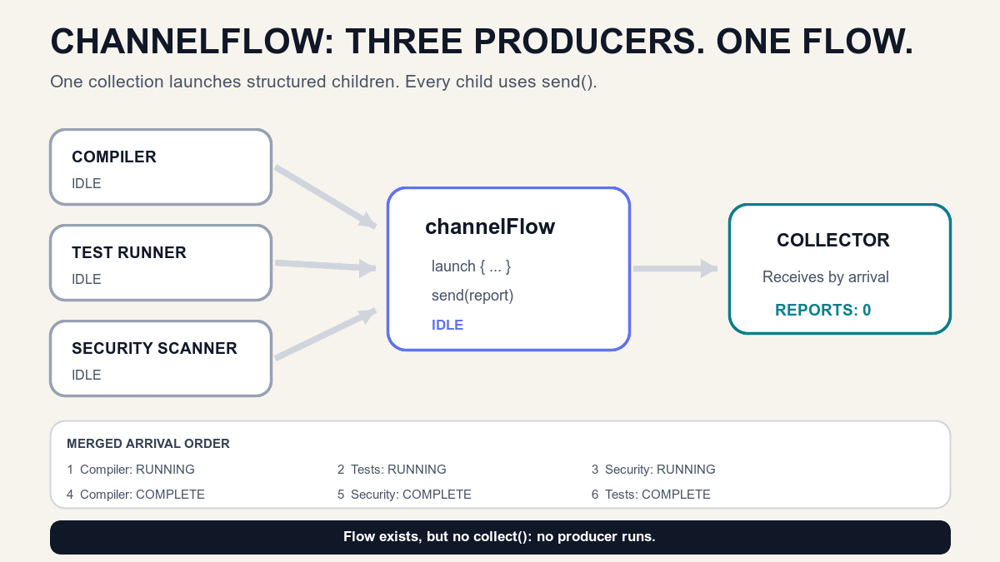

# `channelFlow` — When One Flow Needs Multiple Producers

*A regular `flow` is built for sequential emission. `channelFlow` lets several structured child coroutines send values safely into one cold Flow.*

> **BuildPulse series · Article 4 of 9**
>
> [Previous on Medium: `callbackFlow` — How a Listener Becomes a Flow Without Leaking](https://medium.com/@sandeep84397/callbackflow-how-a-listener-becomes-a-flow-without-leaking-a07d4f438dac) · [Repository article](03-callback-flow.md) · **You are here: `channelFlow`** · Next: Hot streams *(unpublished)*

Article 3 solved one boundary problem.

A CI SDK owned a callback listener. `callbackFlow` registered that listener when collection started, forwarded callbacks with `trySend()`, and removed the listener when collection stopped.

Now BuildPulse has a different problem.

The compiler, test runner, and security scanner can work at the same time:

```text
Compiler ───────────────┐
Test runner ────────────┼─→ one BuildPulse timeline
Security scanner ───────┘
```

Each producer must report progress while it is running. The UI wants one Flow containing those reports in arrival order.

That is the Article 4 problem.

## The engineering problem: one emitter became three

A normal cold Flow is easy when one coroutine owns the sequence:

```kotlin
fun reports(): Flow<BuildReport> = flow {
    emit(compilerStarted)
    emit(compilerCompleted)
}
```

The builder runs sequentially. Each `emit()` happens from that Flow's expected coroutine context.

But our real work is concurrent:

```kotlin
flow {
    launch { emit(compilerReport) }
    launch { emit(testReport) }
    launch { emit(securityReport) }
}
```

This is the wrong builder for that job.

`flow {}` protects context preservation. Emitting from independently launched child coroutines violates the normal Flow emission contract.

The requirement is not “make Flow ignore its rules.”

It is:

> Which Flow builder is designed for several coroutines to produce values concurrently?

## Why is it named `channelFlow`?

The name describes both halves of the mechanism.

- **Channel:** a concurrency-safe sending boundary. Several coroutines can send values into it.
- **Flow:** collectors consume those sent values through the normal Flow API.

```text
Concurrent producers  →  channel  →  Flow collector
```

Inside the builder, child coroutines use `send(report)`.

Outside the builder, callers still receive `Flow<BuildReport>` and use `collect()`.

Memory rule:

> **Many children send. One Flow collects.**

## The cornerstone analogy: one CI control room, three specialist desks

Imagine a CI control room with three specialist desks:

- Compiler desk
- Test desk
- Security desk

All three specialists begin work for the same build. They do not wait for one another.

Whenever a specialist has news, they place a report into one shared inbox. The control-room operator reads reports in the order they arrive.

Mapping:

- Start one control-room session = `collect()`
- Open the shared inbox = `channelFlow {}`
- Start three specialist desks = three `launch {}` children
- Submit a report = `send(report)`
- Read the shared timeline = Flow collector
- Close the control room = cancel collection
- Stop every specialist = structured cancellation

The inbox does not force the compiler to wait for security. It only gives all producers one safe place to send their reports.



The animation shows the important order:

```text
Compiler: RUNNING
Tests: RUNNING
Security: RUNNING
Compiler: COMPLETE
Security: COMPLETE
Tests: COMPLETE
```

This is arrival order, not producer-list order.

## The smallest useful example

Assume each build task can run independently and report values:

```kotlin
fun interface BuildTaskRunner {
    suspend fun run(
        buildId: BuildId,
        report: suspend (BuildReport) -> Unit,
    )
}
```

We can combine several runners with `channelFlow`:

```kotlin
class ChannelFlowBuildReportRepository(
    private val runners: List<BuildTaskRunner>,
) {
    fun observeReports(buildId: BuildId): Flow<BuildReport> = channelFlow {
        runners.forEach { runner ->
            launch {
                runner.run(buildId) { report ->
                    send(report)
                }
            }
        }
    }
}
```

Follow the execution:

```text
observeReports() called
    → returns a cold Flow
    → no runner starts

collect() starts
    → channelFlow block runs
    → child 1 starts compiler
    → child 2 starts tests
    → child 3 starts security scan

any child calls send(report)
    → report enters the channel
    → collector receives it

all children complete
    → channelFlow completes
    → collection completes
```

## `channelFlow` is still cold

The word “channel” can make this confusing.

`channelFlow` returns a cold Flow.

Creating it does not start any producer:

```kotlin
val reports = repository.observeReports(buildId)

// Compiler starts: 0
// Test runner starts: 0
// Security scanner starts: 0
```

Collection starts the work:

```kotlin
reports.collect { report ->
    println(report)
}
```

Collect the same Flow twice and the whole producer group runs twice:

```text
Collector A  → compiler A + tests A + security A
Collector B  → compiler B + tests B + security B
```

The two collectors do not automatically share one workshop.

Sharing comes later in this series.

## Why `send()` instead of `emit()`?

`flow {}` gives you a `FlowCollector`. Its production operation is `emit()`.

`channelFlow {}` gives you a `ProducerScope`. Its production operation is `send()`.

```text
flow { emit(value) }

channelFlow {
    launch { send(value) }
}
```

`send()` is suspending. If the internal channel cannot accept another value immediately, the sending coroutine can suspend instead of blocking a thread.

That is different from Article 3's callback boundary:

- A normal callback usually cannot suspend, so `callbackFlow` commonly uses `trySend()`.
- A child coroutine can suspend, so `channelFlow` can use `send()`.

Memory rule:

> **Callback cannot wait: `trySend()`. Coroutine can wait: `send()`.**

This is a practical memory rule, not a claim that `trySend()` belongs only to `callbackFlow`.

## Structured concurrency owns the whole workshop

The `launch {}` blocks inside `channelFlow` are children of its producer scope.

That gives three important lifecycle rules.

### 1. Completion waits for every child

If compiler and security finish but tests are still running, the Flow stays active.

```text
Compiler complete
Security complete
Tests running
    → channelFlow still running
```

The Flow completes only after the builder block and all its children complete.

### 2. Cancelling collection cancels the children

If the user leaves the Compose screen and collection is cancelled, the channelFlow scope is cancelled. Its child producers are cancelled too.

```text
Collector cancelled
    → channelFlow cancelled
    → compiler child cancelled
    → test child cancelled
    → security child cancelled
```

No detached `GlobalScope` work is needed.

### 3. A child failure fails the group

Suppose the security scanner throws:

```text
Security child fails
    → channelFlow fails
    → sibling children are cancelled
    → collector receives the failure
```

That is normal structured-concurrency behavior. If your domain requires one producer to fail without cancelling the others, that is a separate error-isolation decision. Do not silently add supervision without defining the required semantics.

## `flow` vs `callbackFlow` vs `channelFlow`

Use the producer shape to choose.

### Use `flow` when one coroutine emits sequentially

```kotlin
flow {
    emit(loadFirstPage())
    emit(loadSecondPage())
}
```

Question it answers:

> How does one suspending producer emit values over time?

### Use `callbackFlow` when an external callback API owns the timing

```kotlin
callbackFlow {
    val listener = Listener { value -> trySend(value) }
    source.addListener(listener)
    awaitClose { source.removeListener(listener) }
}
```

Question it answers:

> How does a listener API become a cancellable cold Flow?

### Use `channelFlow` when several coroutines produce concurrently

```kotlin
channelFlow {
    launch { send(loadCompilerReport()) }
    launch { send(loadTestReport()) }
    launch { send(loadSecurityReport()) }
}
```

Question it answers:

> How do several structured producers send values into one Flow?

`callbackFlow` and `channelFlow` are closely related builders. The difference is the problem you are expressing.

## The internal buffer: know that it exists

`channelFlow` uses a channel between producers and the downstream collector. Current kotlinx.coroutines documentation defines a default buffered channel for this builder.

That means a producer may send ahead of a slower collector until available capacity is used. After that, `send()` suspends.

You can change capacity with `buffer()`:

```kotlin
repository.observeReports(buildId)
    .buffer(capacity = 0)
```

But capacity and overflow policy change delivery and backpressure behavior. BuildPulse keeps the default here because Article 4 is about concurrent production, not buffer tuning.

Memory rule:

> **First understand who produces. Then decide how much can wait.**

## The BuildPulse implementation

BuildPulse models three tasks:

```kotlin
enum class BuildTask {
    COMPILER,
    TESTS,
    SECURITY_SCAN,
}
```

Each simulated runner reports `STARTED`, waits for its own duration, then reports `COMPLETED`:

```kotlin
class SimulatedBuildTaskRunner(
    private val task: BuildTask,
    private val startDelayMillis: Long,
    private val workDurationMillis: Long,
) : BuildTaskRunner {

    override suspend fun run(
        buildId: BuildId,
        report: suspend (BuildReport) -> Unit,
    ) {
        delay(startDelayMillis)
        report(BuildReport(buildId, task, BuildReportState.STARTED))
        delay(workDurationMillis)
        report(BuildReport(buildId, task, BuildReportState.COMPLETED))
    }
}
```

The repository launches every runner in the `channelFlow` scope and sends every report into the same stream.

The Android/Compose lab then makes two invisible ideas visible:

- producer state: waiting, running, complete, or cancelled;
- collector order: the exact order in which reports arrived.

Run the lab:

1. Before tapping **Start collection**, every task is waiting.
2. Start collection. One cold `channelFlow` execution begins.
3. Compiler, tests, and security become active independently.
4. Reports appear in one merged timeline.
5. Wait for completion, or tap **Cancel** to stop the whole producer group.
6. Tap **Run again**. A fresh cold execution starts from an empty timeline.

## Tests that protect the behavior

The milestone verifies these rules:

```text
Flow created, not collected  → zero task starts
Collection starts            → all tasks run concurrently
Reports arrive               → one merged Flow preserves arrival order
Collection runs again        → every task starts a fresh execution
Collection cancelled         → every running child is cancelled
One child fails              → siblings cancel; collection fails
```

The concurrency test uses virtual time:

```kotlin
val repository = ChannelFlowBuildReportRepository(
    runners = listOf(
        scheduledRunner(COMPILER, completionDelayMillis = 100),
        scheduledRunner(TESTS, completionDelayMillis = 200),
        scheduledRunner(SECURITY_SCAN, completionDelayMillis = 300),
    ),
)

val reports = repository.observeReports(buildId).toList()

assertEquals(300, currentTime)
```

Sequential execution would take 600 milliseconds. Concurrent execution completes at the slowest child's 300-millisecond mark.

The cancellation test verifies ownership:

```kotlin
val collection = launch {
    repository.observeReports(buildId).collect(received::add)
}

runCurrent()
collection.cancelAndJoin()

assertEquals(3, childCancellations)
```

The UI illustrates the behavior. Tests prove it.

Supporting project:

- [Run the Article 04 checkpoint](https://github.com/sandeep84397/buildpulse-kotlin-flows/tree/article-04-channel-flow)
- [Read the `channelFlow` repository](../app/src/main/java/io/github/buildpulse/simulation/ChannelFlowBuildReportRepository.kt)
- [Read the concurrency tests](../app/src/test/java/io/github/buildpulse/simulation/ChannelFlowBuildReportRepositoryTest.kt)
- [Compare Article 03 with Article 04](https://github.com/sandeep84397/buildpulse-kotlin-flows/compare/article-03-callback-flow...article-04-channel-flow)
- [Open the Article 04 GitHub release](https://github.com/sandeep84397/buildpulse-kotlin-flows/releases/tag/article-04-channel-flow)

## When should you use `channelFlow`?

Use it when:

- several coroutines must produce values concurrently;
- those values must become one Flow;
- child lifetimes should follow collection;
- producer completion, cancellation, and failure should remain structured;
- sending may happen from different coroutine contexts.

Common Android and backend examples:

- merge progress from parallel upload parts;
- combine independent device scans into one discovery stream;
- report concurrent validation checks;
- merge several suspending data sources;
- implement a custom concurrent Flow operator;
- stream progress from compiler, test, and security jobs.

Do not choose it automatically when:

- one coroutine can emit sequentially — use `flow`;
- an existing listener API needs registration and cleanup — use `callbackFlow`;
- existing Flows only need a standard operator such as `merge` or `combine`;
- many collectors must share one upstream execution — sharing is the next problem;
- you need a worker queue where each item goes to one receiver — that points toward `Channel`, covered later.

## Common mistakes

### “`channelFlow` is hot because it contains a channel.”

No. The returned Flow is cold. Each collection runs a new builder execution and launches a new child group.

### “`channelFlow` makes sequential code faster.”

No. Concurrency appears only when you launch or otherwise run producers concurrently. A builder name does not create useful parallelism by itself.

### “The report order is deterministic.”

Only if producer timing is deterministic. The collector receives values in actual send/arrival order.

### “I should use `channelFlow` whenever I see two Flows.”

Usually not. Standard operators such as `merge`, `combine`, `zip`, and `flatMapMerge` already express common relationships. Reach for `channelFlow` when you are implementing a producer boundary or custom concurrent behavior those operators do not express clearly.

### “Cancellation only stops the collector.”

Cancellation propagates into the `channelFlow` scope and its structured children.

### “One producer can fail while the others continue automatically.”

Not under normal structured failure propagation. Define error isolation deliberately if the product requires it.

### “The buffer guarantees every value survives cancellation.”

No. Cancellation can discard work or values still in flight. A Flow is not durable storage.

## The complete mental model

When considering `channelFlow`, ask six questions:

1. **Multiplicity:** Do multiple coroutines need to produce?
2. **Start:** Which collection starts those producers?
3. **Send:** Which child calls `send()` for each value?
4. **Order:** Does the product accept arrival order?
5. **Failure:** Should one child failure cancel the group?
6. **Cancellation:** Must all child work stop when collection stops?

For BuildPulse:

```text
Flow created          → no task runs
Collector starts      → three child tasks start
Child sends report    → collector receives it
Children interleave   → timeline follows arrival order
All children finish   → Flow completes
Collector cancels     → every child cancels
Collector starts again→ new cold execution
```

If you can predict those transitions, you understand `channelFlow`.

## Where we go next

BuildPulse can now combine several concurrent producers into one cold Flow.

But a new problem appears when two screens collect it:

```text
Dashboard collects  → compiler + tests + security start
Details collects    → compiler + tests + security start again
```

Sometimes that is correct. Sometimes both screens should observe one already-running upstream operation.

Next question:

> What keeps producing independently of one collector, and how can several collectors observe the same stream?

That begins our discussion of hot streams.

## Official references

- [Kotlin `channelFlow` API](https://kotlinlang.org/api/kotlinx.coroutines/kotlinx-coroutines-core/kotlinx.coroutines.flow/channel-flow.html)
- [Kotlin Flow API and context-preservation rules](https://kotlinlang.org/api/kotlinx.coroutines/kotlinx-coroutines-core/kotlinx.coroutines.flow/-flow/)
- [Kotlin Flow guide](https://kotlinlang.org/docs/flow.html)
- [Kotlin `send` API](https://kotlinlang.org/api/kotlinx.coroutines/kotlinx-coroutines-core/kotlinx.coroutines.channels/-send-channel/send.html)
- [Kotlin structured-concurrency guidance](https://kotlinlang.org/api/kotlinx.coroutines/kotlinx-coroutines-core/kotlinx.coroutines/-coroutine-scope/)

---

*BuildPulse is one evolving Android/Compose system. Each article introduces only the next concept required by the engineering problem, and each GitHub milestone remains runnable.*
